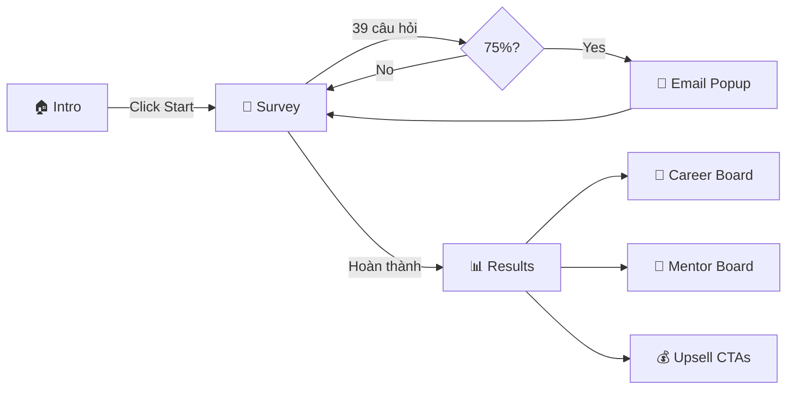

# 🎯 IKIGAI — Ứng Dụng Hướng Nghiệp Theo Triết Lý Nhật Bản

<p align="center">
  
  
  
  
</p>

> **IKIGAI (生き甲斐)** — "Lý do để bạn thức dậy mỗi sáng"
>
> Ứng dụng hướng nghiệp dựa trên triết lý IKIGAI của Nhật Bản, giúp người dùng tìm ra ngành nghề phù hợp nhất thông qua giao thoa của 4 trụ cột: **Đam mê** ❤️ · **Năng lực** ⚡ · **Sứ mệnh** 🌍 · **Thị trường** 💰

🌐 **Live Demo:** [basao-founder-os.vercel.app](https://basao-founder-os.vercel.app)

---

## 💡 Ý Tưởng

### Vấn đề
Rất nhiều người trẻ Việt Nam đang:
- Chọn nghề theo cảm tính hoặc áp lực gia đình
- Làm công việc không phù hợp với bản thân → burn-out
- Không biết bắt đầu từ đâu để chuyển đổi ngành nghề
- Thiếu mentor và định hướng chuyên nghiệp

### Giải pháp: IKIGAI Assessment
Ứng dụng phương pháp IKIGAI — triết lý sống 1000 năm tuổi từ Nhật Bản — để giúp người dùng tìm ra "vùng vàng" nghề nghiệp, nơi giao thoa của:

```
        ❤️ What You LOVE (Đam mê)
              ╲        ╱
    Passion ────╲────╱──── Mission
              ╲  🎯  ╱
    ⚡ What You're ──── 🌍 What The World
      GOOD AT      IKIGAI      NEEDS
              ╱  🎯  ╲
   Profession ────╱────╲──── Vocation
              ╱        ╲
        💰 What You Can Be PAID FOR
```

### Mô hình kinh doanh: Phễu chuyển đổi

```
┌─────────────────────────────────────────┐
│  FREE: Bài test IKIGAI 39 câu hỏi      │ ← Thu hút traffic
│  → Radar Chart + Career Board           │
│  → Gợi ý ngành nghề + Mentor           │
├─────────────────────────────────────────┤
│  📧 Email Capture (popup 75%)           │ ← Xây dựng database
├─────────────────────────────────────────┤
│  💰 Khoá học Định Hướng Nghề — 1.990k  │ ← Upsell sản phẩm
├─────────────────────────────────────────┤
│  🧭 Coaching 1:1 với Mentor — 350k+    │ ← High-ticket
└─────────────────────────────────────────┘
```

---

## ✨ Tính Năng

| Feature | Mô tả |
|---------|-------|
| 📝 **39 Câu Hỏi IKIGAI** | Đánh giá toàn diện 4 trụ cột (10+10+10+9), có trọng số đặc biệt cho câu quan trọng |
| 📊 **Radar Chart** | Biểu đồ năng lực IKIGAI 4 chiều (Chart.js) |
| 🧬 **Phân tích Ikigai Zone** | 6 vùng: IKIGAI Zone, Passion, Profession, Mission, Vocation, Exploration |
| 🎯 **Career Matching** | AI gợi ý top 8 ngành nghề từ database 18 careers × 6 categories |
| 🧭 **Mentor Matching** | 7 mentor được gợi ý dựa trên career path |
| 📧 **Email Capture** | Popup tự động tại 75% + form trên trang kết quả |
| 💰 **Upsell CTAs** | Khoá học + Coaching 1:1 |
| 📱 **Responsive** | Mobile-first, tối ưu mọi thiết bị |
| 🌙 **Premium Dark Theme** | Glassmorphism, gradient, micro-animations |

---

## 🏗️ Kiến Trúc

```
ikigai-career-app/
├── index.html        ← SPA (Intro → Survey → Results)
├── style.css         ← Design system + IKIGAI branding
├── questions.js      ← 39 câu hỏi + tags + weights
├── careers.js        ← 18 careers + 7 mentors + matching engine
├── app.js            ← Survey engine + scoring + rendering
├── auto-test.js      ← Puppeteer auto-test (5 profiles)
└── .gitignore
```

### Luồng hoạt động



### Scoring Engine

Mỗi câu hỏi thuộc 1 trong 4 pillar, có:
- **Ratings 1-5** từ người dùng
- **Weight** (1.0 hoặc 1.5) cho câu quan trọng
- **Tags** (tech, creative, social, finance...) cho career matching

```
Pillar Score = Σ(answer × weight) / Σ(5 × weight) × 100
Career Match = Σ(tag_scores) — sorted by total
```

---

## 📊 Kết Quả Auto-Test

| Profile | ❤️ Love | ⚡ Good | 🌍 Need | 💰 Paid | Zone | Top Career |
|---------|---------|---------|---------|---------|------|------------|
| Tech Founder | 80 | 79 | 81 | 75 | IKIGAI 🎯 | Data Analyst |
| Creative Marketer | 83 | 74 | 74 | 74 | IKIGAI 🎯 | Life Coach |
| Business Strategist | 68 | 80 | 70 | 83 | IKIGAI 🎯 | Financial Advisor |
| Coach Educator | 75 | 75 | 81 | 66 | IKIGAI 🎯 | Life Coach |
| Digital Nomad | 80 | 77 | 61 | 82 | Exploration 🔍 | Freelancer |

---

## 🚀 Cài Đặt & Chạy

```bash
# Clone
git clone https://github.com/manhcuongk55/ikigai-career-app.git
cd ikigai-career-app

# Chạy local
npx http-server . -p 8080

# Mở trình duyệt
open http://localhost:8080
```

### Auto-test (Puppeteer)

```bash
npm install
node auto-test.js
# → Screenshots trong ./screenshots/
# → Data trong test_results.json
```

---

## 🛣️ Roadmap

- [x] Bài test 39 câu hỏi IKIGAI
- [x] Career matching engine (18 careers)
- [x] Mentor matching (7 mentors)
- [x] Radar chart (Chart.js)
- [x] Email capture popup
- [x] Premium dark theme
- [x] Deploy Vercel
- [ ] Backend API (Node.js/Express)
- [ ] Database (PostgreSQL/Supabase)
- [ ] PDF report generation
- [ ] Payment integration (Stripe/VNPay)
- [ ] Mentor booking system
- [ ] Admin dashboard
- [ ] Mobile app (React Native)

---

## 📄 License

MIT © 2026 IKIGAI Career Guidance

---

<p align="center">
  <strong>IKIGAI</strong> · 生き甲斐 · Lý do để bạn thức dậy mỗi sáng
</p>
